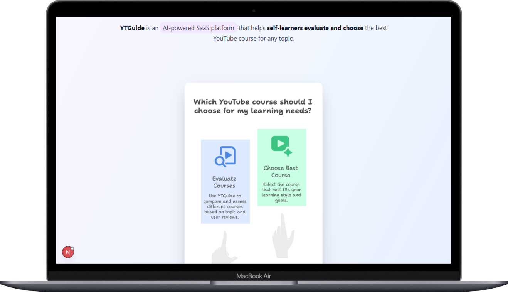
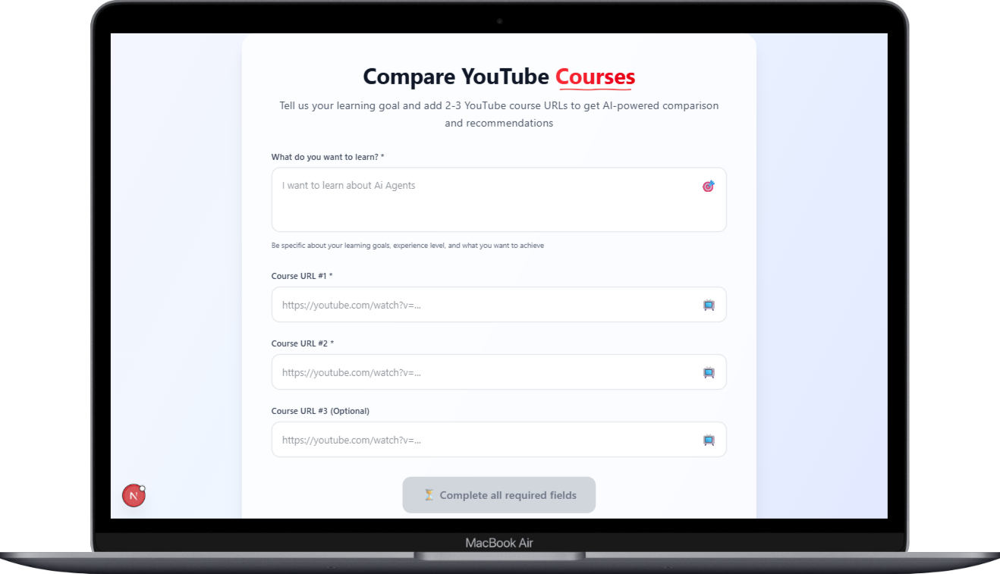
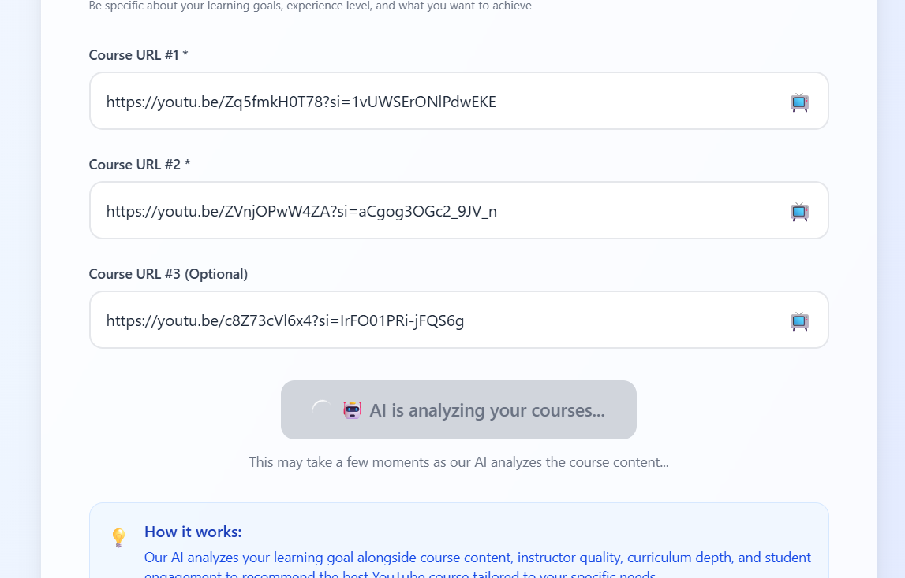
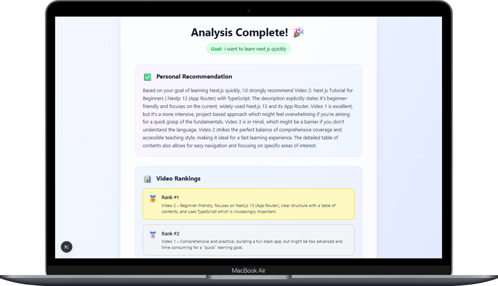
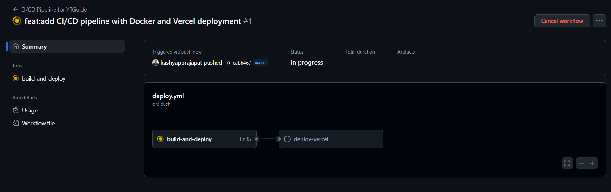
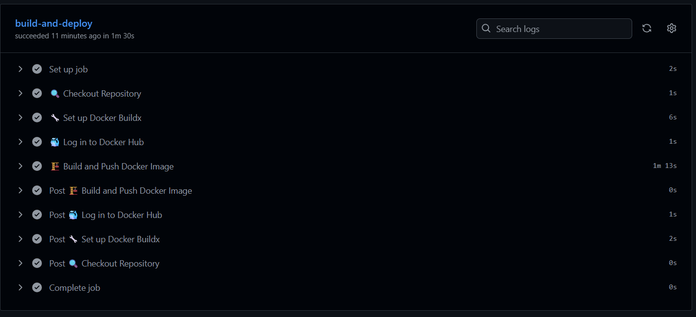

# 🎓 YTGuide


**Helping self-learners make smarter YouTube choices with AI-powered course comparison**

---

## 🌟 Overview

**YTGuide** is an intelligent platform that revolutionizes how self-learners discover and choose YouTube courses. Instead of spending hours researching which tutorial to follow, simply paste 2 or more YouTube links and let our AI do the heavy lifting.

### 🎯 The Problem I Solve
- 📚 **Information Overload**: Too many YouTube courses on every topic
- ⏰ **Time Wasted**: Hours spent evaluating course quality manually  
- 🤔 **Decision Paralysis**: Difficulty choosing between similar courses
- 📉 **Quality Inconsistency**: No easy way to identify outdated or low-quality content

### 💡 My Solution
YTGuide analyzes and compares YouTube courses using advanced AI, providing:
- ✅ **Content Quality Analysis** - Deep dive into course structure and completeness
- 🎯 **Relevance Scoring** - How well the course matches your learning goals
- 📅 **Recency Check** - Ensures content is up-to-date with current trends
- 🏆 **Smart Rankings** - Clear recommendations with detailed reasoning

---

## 🚀 Live Deployments

| Platform | Status | URL | Description |
|----------|--------|-----|-------------|
| 🔗 **Vercel** | ✅ Active | [yt-guide-one.vercel.app](https://yt-guide-one.vercel.app/) | Primary production deployment |
| 🐳 **Koyeb** | ✅ Active | [damp-hawk-kashyap-6a7ed6bb.koyeb.app](https://damp-hawk-kashyap-6a7ed6bb.koyeb.app/) | Docker-based deployment |
| 🎯 **Render** | ✅ Active | [ytguide-frontend.onrender.com](https://ytguide-frontend.onrender.com/) | Alternative hosting solution |

---

## ⚡ Key Features

### 🔍 **Smart Course Analysis**
- AI-powered content evaluation
- Automated quality scoring
- Learning outcome prediction

### 📊 **Comprehensive Comparison**
- Side-by-side course breakdown
- Detailed pros and cons analysis
- Time investment estimates

### 🎯 **Personalized Recommendations**
- Goal-based course matching
- Skill level considerations
- Learning style preferences

### ⚡ **Lightning Fast Results**
- Process multiple courses in seconds
- Real-time analysis and ranking
- Instant decision support

---

## 🛠️ Tech Stack

### Frontend
- **Next.js 14** - React framework with App Router
- **Tailwind CSS** - Utility-first CSS framework
- **Lucide React** - Beautiful icon library
- **Shadcn/ui** - High-quality UI components

### DevOps & Deployment
- **Docker** - Containerization for consistent deployments
- **GitHub Actions** - Automated CI/CD pipeline
- **Vercel** - Serverless deployment platform
- **Docker Hub** - Container registry

---

## 📸 Application Screenshots

### 🏠 Homepage & Features
<p align="center">
  
  
</p>

### 🔧 Core Functionality
<p align="center">
  
  
</p>

### 📊 Results & Analysis
<p align="center">
  
</p>

---

## 🔄 CI/CD Pipeline

### 🚀 Automated Workflow
Our robust CI/CD pipeline ensures reliable deployments:

<p align="center">
  
</p>

### 🐳 Docker Integration
<p align="center">
  
</p>

### ⚡ Deployment Success
<p align="center">
  
</p>

### Pipeline Features:
- ✅ **Automated Testing** - Code quality checks on every commit
- 🐳 **Docker Build** - Containerized application builds
- 🚀 **Multi-Platform Deployment** - Simultaneous deployment to Vercel and Docker Hub
- 🔒 **Security Scanning** - Automated vulnerability detection
- 📊 **Build Status Monitoring** - Real-time pipeline status tracking

---

## 🚦 Getting Started

### Prerequisites
- Node.js 18+ 
- npm or yarn
- Docker (optional)

### Local Development

1. **Clone the repository**
   ```bash
   git clone https://github.com/kashyapprajapat/ytguide-frontend.git
   cd ytguide-frontend
   ```

2. **Install dependencies**
   ```bash
   npm install
   ```

3. **Start development server**
   ```bash
   npm run dev
   ```

4. **Open in browser**
   ```
   http://localhost:3000
   ```

### Docker Deployment

**Pre-built Image Available**: [kashyap14112003/ytguidefrontend](https://hub.docker.com/r/kashyap14112003/ytguidefrontend)

#### Option 1: Use Pre-built Image (Recommended)
```bash
# Pull and run the latest image
docker pull kashyap14112003/ytguidefrontend:latest
docker run -d --name ytguide-app -p 3000:3000 kashyap14112003/ytguidefrontend:latest
```

#### Option 2: Build from Source
```bash
# Build your own image
docker build -t ytguide-frontend .
docker run -d --name ytguide-app -p 3000:3000 ytguide-frontend
```

#### Docker Commands
```bash
# View running containers
docker ps

# Stop the container
docker stop ytguide-app

# Remove the container
docker rm ytguide-app

# View logs
docker logs ytguide-app
```

---

## 📂 Project Structure

```
ytguide-frontend/
├── 📁 src/
│   ├── 📁 app/
│   │   ├── globals.css
│   │   ├── layout.js
│   │   └── page.js
│   ├── 📁 components/
│   │   ├── Header.jsx
│   │   ├── InfoComponent.jsx
│   │   ├── YouTubeUrlComponent.jsx
│   │   └── 📁 ui/
│   └── 📁 lib/
├── 📁 .github/
│   └── 📁 workflows/
│       └── deploy.yml
├── 📁 DemoImage/
├── Dockerfile
├── package.json
└── README.md
```

---

## 🤝 Contributing

We welcome contributions! Here's how you can help:

1. **Fork the repository**
2. **Create a feature branch** (`git checkout -b feature/amazing-feature`)
3. **Commit your changes** (`git commit -m 'feat: add amazing feature'`)
4. **Push to the branch** (`git push origin feature/amazing-feature`)
5. **Open a Pull Request**

### Contribution Guidelines
- Follow conventional commit messages
- Add tests for new features
- Update documentation as needed
- Ensure CI/CD pipeline passes

---

## 🙏 Acknowledgments

- **OpenAI** - For providing the AI capabilities that power our analysis
- **Vercel** - For seamless deployment and hosting
- **Next.js Community** - For the amazing framework and ecosystem
- **All Beta Users** - For valuable feedback and testing

---

## 👨‍💻 About the Developer

**Developed with ❤️ by [Kashyap Prajapat](https://github.com/kashyapprajapat)**

- 🌐 Portfolio: [your-portfolio.com](https://kashyapprajapati.netlify.app/)

---

## 📊 Project Stats


---

<div align="center">

**⭐ Star this repo if you find it helpful!**

Developed with ❤️ by Kashyap ☕🧋👨🏻‍💻

</div>


